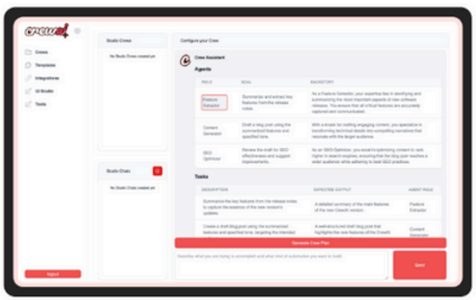
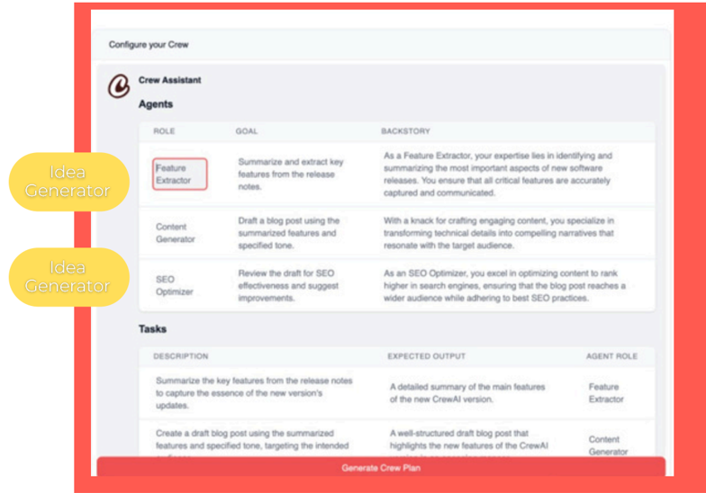
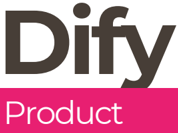
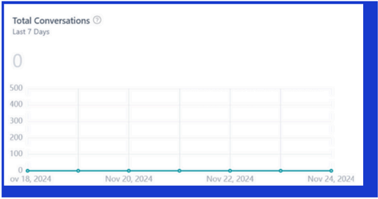
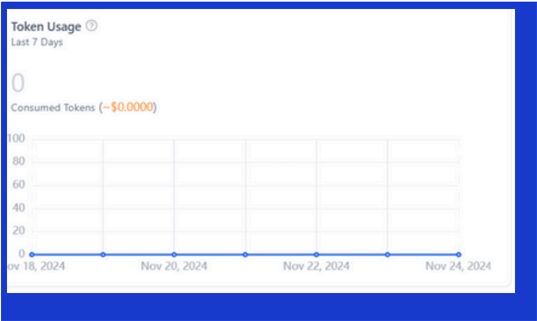
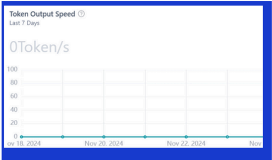

## Arcee Orchestra Competitor Analysis

Key Facts about

By Sahana Raghuraman, Marketing Intern December 16, 2024

## CrewAI

## Product

## Crew Multi-Agent Platform

- Promoted as a full-cycle multi-agent development platform: plan, build, deploy, monitor, and iterate.
- The Enterprise version requires signing up for a free trial (they claim to have a very long waitlist).
- The platform has several resources to get started: videos, courses, ROI models, use case libraries, and idea generators.
- CrewAI's framework and UI Studio: Code from scratch or use no-code templates. Real-time dashboards and analytics help monitor and optimize agent performance.
- Good features to continuously tweak, scale, and improve workflows with ease.

Available for enterprise and as open-source.

## 1: Plan Step

Designing muti-agentic automations begin with lots of practical courses and videos. There are also lots of tactical tools ROI models to use case libraries and idea generators that we can provide to your team to get started. from

Start Free Trial

Want A Demo

## CrewAI (cont'd)

## Workflows of Focus

Hundreds of use cases across Sales, Customer service, Marketing, Fintech, and Software development. Driven by the CrewAI community.

## Categories of use cases

- Qualitative Content: Tasks like marketing and entertainment content creation.
- Qualitative and Quantitative Mix: Areas such as sales strategies, new feature development, and hiring processes.
- High Precision: Business processes demanding greater accuracy; supplemented with domain-specific knowledge and rigorous validation.
- Very High Precision: Fields like accounting and financial modeling.

Interesting quote from their recent Series A press release:

More than 65% of companies are now using generative AI but almost all of them still express significant concerns about results accuracy and data security. These challenges are holding back the full potential of LLMs for the enterprise. This is especially true for the automation of complex tasks in areas like marketing, accounting, and finance. Companies have not been able to use robotic process automation (RPA) for these use cases due to its rigid, deterministic approach, high implementation costs, brittleness, and inability to self-heal .'

## Current Customers

Some of their enterprise customers include: Deloitte, Aurecon, Oracle, KPMG, Accenture, and PwC.

Signed up 150 beta enterprise customers.

They claim that 40% of the US Fortune 500 is currently using their open-source framework.

## Key Value Drivers:

- Adaptive Automation: Moves beyond rigid RPA workflows by enabling dynamic AI agents.
- Seamless Integration: Integrates with over 1,000 applications making it easy to adopt.
- Data Privacy and Security
- Model Flexibility and Automation: Supports multiple LLM models.
- Low-code/no-code accessibility.

## Number of Integrations

CrewAI integrates with most LLMs.

Real-time data integration with 700+ applications such as SAP, Salesforce, Hubspot, Workday, Airtable, Square, etc.

## Monitoring and Observability

## Key Features

- Set performance metrics for each agent and crew.
- Real-time dashboard: Track progress, and get alerts for anomalies and delays.
- Review agent interactions.
- Adjust task allocation.
- Fine-tune agent behaviors based on continuous feedback loops.

Dify is an open-source LLM app development platform. They orchestrate LLM apps from agents to complex AI workflows, with a RAG engine. Their tagline is that they are 'more production-ready than LangChain.'

## KEY COMPONENTS

## Dify Orchestration Studio

- A low-code/no-code platform designed to help enterprises and developers create, automate, and deploy AI applications.
- Unlike LangChain and CrewAI, Dify targets non-technical users.

## RAG Pipeline

- Helps to build data pipelines, enhancing retrieval-augmented generation.

## Prompt IDE

- Dedicated tool for designing, testing, and refining advanced prompts for LLMs optimizing model interaction.

## Enterprise LLMOps

- Supports operations like monitoring, model reasoning, recording locks, annotating data, and fine-tuning models.

## Backend as a Service

- Provides backend APIs to seamlessly integrate into any product.

## LLM Agent

- Customizable agents that can execute multi-step tasks.

## Workflow:

- Enables Orchestration of AI workflows.

Available as Dify Community, Dify Cloud, and Dify Premium on AWS.

## Workflows of Focus

## DIFY DIVIDES WORKFLOWS INTO TWO TYPES

## Chatflow

- Designed for conversational scenarios, including customer service, semantic search, and other conversational applications that require multi-step logic in response construction.

## Workflow

- Geared towards automation and batch processing scenarios.
- Suitable for high quality translation, data analysis, content generation, email automation, and more.
- Common workflows promoted: customer service, content generation, task automation, data analysis and reporting, email automation.

## Dify (con'td)

## Current Customers

- A major consumer electronics company with 100 million+ customers has deployed Dify to enable technical and non-technical teams to create AI applications. Dify has not disclosed the name of its customer, but intelligence reveals it could be Samsung.
- Dify's adoption seems to be among startups and developers for prototyping rapidly.
- Their low-code/no-code platform (Dify Orchestration Studio) seems to be quite popular.

## Number of Integrations

22+ model providers.

## OTHER INTEGRATIONS INCLUDE

- Search Engines: Google Search, Bing, Perplexity Search, and SearXNG.
- Image and Creative Tools: DALL-E, Stable Diffusion, ComfyUI.
- Data and Finance Tools: Yahoo Finance, AlphaVantage.
- Development Tools: OpenAI APIs, Hugging Face, LangChain.
- Monitoring and Analytics : LangSmith, Langfuse .

## Monitoring and Observability

Dify offers data analytics dashboards that enable users to monitor and track application (chatbots and APIs) performance.

## KEY FEATURES

- Usage Cost Analysis: Monitor and manage expenses associated with application usage.
- Latancy Tracking: Assess response times to ensure optimal performance.
- User Feedback Collection: Gather and analyze user input to enhance application functionality.
- Performance Metrics: Evaluate overall application efficiency and effectiveness via these metrics: Total AI Conversations | Active Users | Average Session Interactions | Token Output Speed | User
- Satisfaction (number of likes per 1000 messages) | Daily Token Usage | Total Messages (daily AI interactions count).

## Product

## Three Products

## LangChain

This is their core product and it implifies the process of building and deploying LLM applications. It's used by many enterprises and adopted by a large developer community. It allows developers to create "chains" of operations, where LLMs interacts with components like APIs, databases, and user inputs.

## LangSmith

Platform for monitoring, testing, and optimizing LLM applications.

## LangGraph

- Agent development with orchestration.
- Includes LangGraph Platform, a service for deploying and scaling LangGraph application with APIs for building agent UX plus an integrated developer studio.

## Workflows of Focus

## LangGraph promotes multi-agent workflows across the enterprise.

It's a core, centralized framework that orchestrates or manages the activities of multiple agents.

- Early Adopters: Ally Financial, Norwegian Cruise Lines.

Software development workflows are a popular use case.

## Number of Integrations

## 35+ providers, including model and database providers such as

- OpenAI, Google VertexAI, HuggingFace, Pinecone, MongoDB.

## Tools Supported

- Search Engines: Bing, Google, etc.
- Productivity: Jira, Slack, Twilio, Office365, Github, etc.
- Databases: SQLDatabase, Spark SQL, and Cassandra Database.
- Other: Alpha Vantage (financial services), Amadeus (travel), Databricks, ChatGPT Plugins, etc.

## Current Customers

## A diverse mix of customers across industries

- Rakuten
- Replit
- Podium
- Elastic
- Ally Financial
- Norwegian Cruise Lines
- Apple
- Capital One
- Morningstar
- Microsoft

## Monitoring and Observability

LangSmith provides end-to-end trace observability, cost, latency, and error tracking via monitoring charts, dashboards, and integration with external observability tools like Grafana, LLMonitor, etc.

Full information available here .

