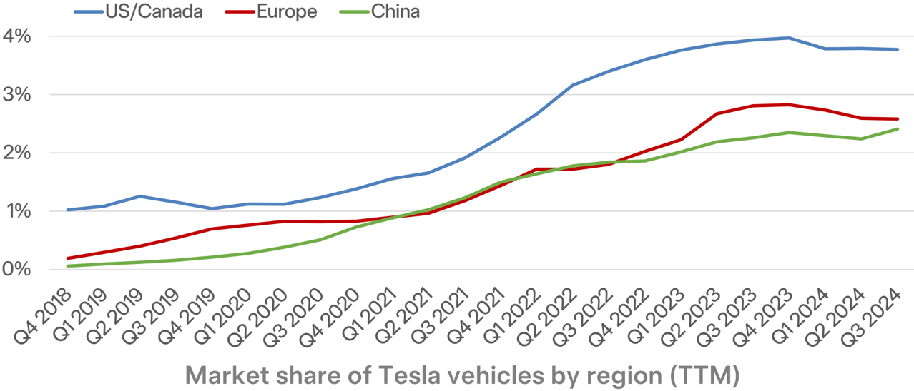
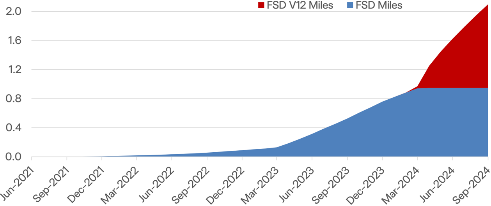
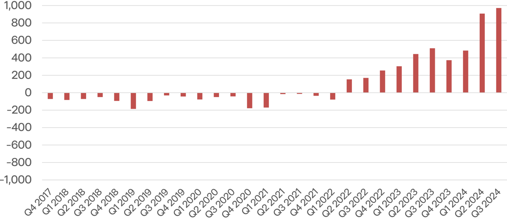
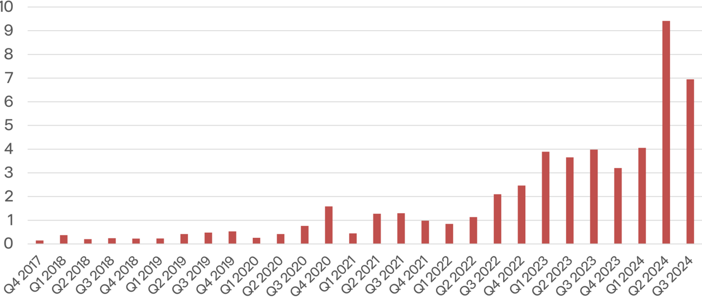
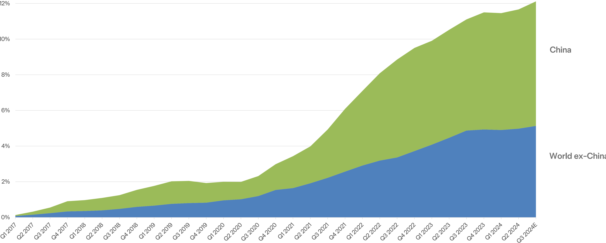
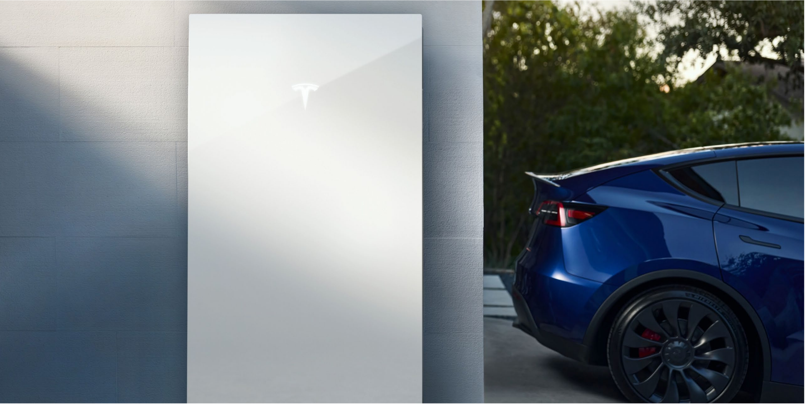
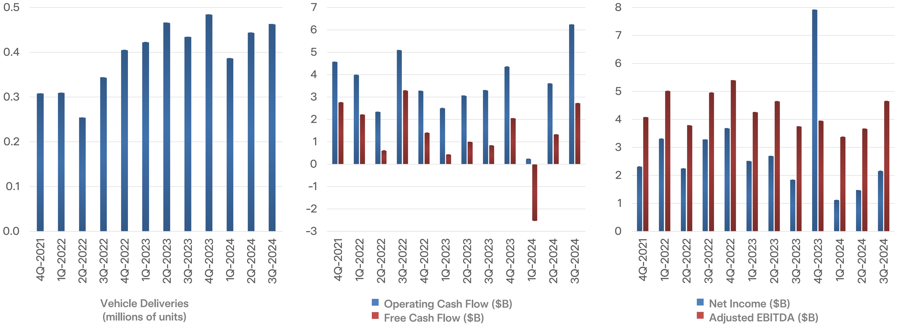
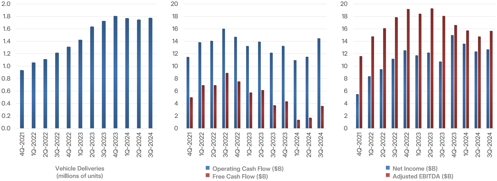

1

## Q3 2024 Update

2

| Highlights             |   03 |
|------------------------|------|
| Financial Summary      |   04 |
| Operational Summary    |   06 |
| Vehicle Capacity       |   07 |
| Core Technology        |   08 |
| Other Highlights       |   09 |
| Outlook                |   10 |
| Photos & Charts        |   11 |
| Key Metrics            |   23 |
| Financial Statements   |   25 |
| Additional Information |   31 |

## H I G H L I G H T S

Profitability

$2.7B GAAP operating income in Q3

$2.2B GAAP net income in Q3

$2.5B non-GAAP net income 1 in Q3

Cash

Operating cash flow of $6.3B in Q3

Free cash flow 2 of $2.7B in Q3

$2.9B increase in our cash and investments 3 in Q3 to $33.6B

Operations

Increased AI training compute by over 75% in Q3

Cybertruck became the third best-selling EV in Q3 in the U.S. (behind only Model Y and Model 3)

Over two billion miles driven cumulatively on FSD (Supervised) 4 as of Q3 with more than 50% on V12

## S U M M A R Y

We delivered strong results in Q3 with growth in vehicle deliveries both sequentially and year-on-year, resulting in record third-quarter volumes. We also recognized our secondhighest quarter of regulatory credit revenues as other OEMs are still behind on meeting emissions requirements.

Our cost of goods sold (COGS) per vehicle 5 came down to its lowest level ever at ~$35,100. In order to continue accelerating the world's transition to sustainable energy, we need to make EVs affordable for everyone, including making total cost of ownership per mile competitive with all forms of transportation. Preparations remain underway for our offering of new vehicles - including more affordable models - which we will begin launching in the first half of 2025. At our "We, Robot" event on October 10, we detailed our long-term goal of offering autonomous transport with a cost per mile below rideshare, personal car ownership and even public transit.

The Energy business achieved another strong quarter with a record gross margin. Additionally, the Megafactory in Lathrop produced 200 Megapacks in a week, and Powerwall deployments reached a record for the second quarter in a row as we continue to ramp Powerwall 3.

Despite sustained macroeconomic headwinds and others pulling back on EV investments, we remain focused on expanding our vehicle and energy product lineup, reducing costs and making critical investments in AI projects and production capacity. We believe these efforts will allow us to capitalize on the ongoing transition in the transportation and energy sectors.

## F I N A N C I A L   S U M M A R Y

(Unaudited)

| ($ in millions, except percentages and per share data)      | Q3-2023   | Q4-2023   | Q1-2024   | Q2-2024   | Q3-2024   | YoY    |
|-------------------------------------------------------------|-----------|-----------|-----------|-----------|-----------|--------|
| Total automotive revenues                                   | 19,625    | 21,563    | 17,378    | 19,878    | 20,016    | 2%     |
| Energy generation and storage revenue                       | 1,559     | 1,438     | 1,635     | 3,014     | 2,376     | 52%    |
| Services and other revenue                                  | 2,166     | 2,166     | 2,288     | 2,608     | 2,790     | 29%    |
| Total revenues                                              | 23,350    | 25,167    | 21,301    | 25,500    | 25,182    | 8%     |
| Total gross profit                                          | 4,178     | 4,438     | 3,696     | 4,578     | 4,997     | 20%    |
| Total GAAP gross margin                                     | 17.9%     | 17.6%     | 17.4%     | 18.0%     | 19.8%     | 195 bp |
| Operating expenses                                          | 2,414     | 2,374     | 2,525     | 2,973     | 2,280     | -6%    |
| Income from operations                                      | 1,764     | 2,064     | 1,171     | 1,605     | 2,717     | 54%    |
| Operating margin                                            | 7.6%      | 8.2%      | 5.5%      | 6.3%      | 10.8%     | 323 bp |
| Adjusted EBITDA                                             | 3,758     | 3,953     | 3,384     | 3,674     | 4,665     | 24%    |
| Adjusted EBITDA margin                                      | 16.1%     | 15.7%     | 15.9%     | 14.4%     | 18.5%     | 243 bp |
| Net income attributable to common stockholders (GAAP)       | 1,853     | 7,928     | 1,129     | 1,478     | 2,167     | 17%    |
| Net income attributable to common stockholders (non-GAAP)   | 2,318     | 2,485     | 1,536     | 1,812     | 2,505     | 8%     |
| EPS attributable to common stockholders, diluted (GAAP)     | 0.53      | 2.27      | 0.34      | 0.42      | 0.62      | 17%    |
| EPS attributable to common stockholders, diluted (non-GAAP) | 0.66      | 0.71      | 0.45      | 0.52      | 0.72      | 9%     |
| Net cash provided by operating activities                   | 3,308     | 4,370     | 242       | 3,612     | 6,255     | 89%    |
| Capital expenditures                                        | (2,460)   | (2,306)   | (2,773)   | (2,270)   | (3,513)   | 43%    |
| Free cash flow                                              | 848       | 2,064     | (2,531)   | 1,342     | 2,742     | 223%   |
| Cash, cash equivalents and investments                      | 26,077    | 29,094    | 26,863    | 30,720    | 33,648    | 29%    |

## F I N A N C I A L S U M M A R Y

## Revenue

Total revenue increased 8% YoY in Q3 to $25.2B. YoY, revenue was impacted by the following items:

Profitability

Cash

- + growth in vehicle deliveries
- + growth in Energy Generation and Storage and Services and Other
- + higher FSD revenue recognition YoY for releases related to Cybertruck and certain features such as Actually Smart Summon
- + higher regulatory credit revenue
- - reduced S3XY vehicle average selling price (ASP) (excl. FX impact), due to mix, pricing and attractive financing options

Our operating income increased YoY to $2.7B in Q3, resulting in a 10.8% operating margin. YoY, operating income was primarily impacted by the following items:

- + lower cost per vehicle, including lower raw material costs, freight and duties and other one-time charges
- + growth in Energy Generation and Storage and Services and Other gross profit
- + higher FSD revenue recognition YoY for releases related to Cybertruck and certain features such as Actually Smart Summon + growth in vehicle deliveries
- + higher regulatory credit revenue
- + decrease in operating expenses including cost-reduction efforts
- - reduced S3XY vehicle ASP

Quarter-end cash, cash equivalents and investments in Q3 was $33.6B. The sequential increase of $2.9B was primarily the result of positive free cash flow of $2.7B.

## O P E R A T I O N A L   S U M M A R Y

(Unaudited)

|                                                    | Q3-2023   | Q4-2023   | Q1-2024   | Q2-2024   | Q3-2024   | YoY   |
|----------------------------------------------------|-----------|-----------|-----------|-----------|-----------|-------|
| Model 3/Y production                               | 416,800   | 476,777   | 412,376   | 386,576   | 443,668   | 6%    |
| Other models production                            | 13,688    | 18,212    | 20,995    | 24,255    | 26,128    | 91%   |
| Total production                                   | 430,488   | 494,989   | 433,371   | 410,831   | 469,796   | 9%    |
| Model 3/Y deliveries                               | 419,074   | 461,538   | 369,783   | 422,405   | 439,975   | 5%    |
| Other models deliveries                            | 15,985    | 22,969    | 17,027    | 21,551    | 22,915    | 43%   |
| Total deliveries                                   | 435,059   | 484,507   | 386,810   | 443,956   | 462,890   | 6%    |
| of which subject to operating lease accounting     | 17,423    | 10,563    | 8,365     | 10,227    | 14,449    | -17%  |
| Total end of quarter operating lease vehicle count | 176,231   | 176,564   | 173,131   | 171,353   | 168,867   | -4%   |
| Global vehicle inventory (days of supply) (1)      | 16        | 15        | 28        | 18        | 19        | 19%   |
| Storage deployed (GWh)                             | 4.0       | 3.2       | 4.1       | 9.4       | 6.9       | 75%   |
| Tesla locations                                    | 1,129     | 1,208     | 1,258     | 1,286     | 1,306     | 16%   |
| Mobile service fleet                               | 1,846     | 1,909     | 1,897     | 1,896     | 1,933     | 5%    |
| Supercharger stations                              | 5,595     | 5,952     | 6,249     | 6,473     | 6,706     | 20%   |
| Supercharger connectors                            | 51,105    | 54,892    | 57,579    | 59,596    | 62,421    | 22%   |

## V E H I C L E C A P A C I T Y

Production and delivery volumes both returned to year-on-year growth in Q3. We also produced our 7-millionth vehicle October 22 nd . We continued to add to our vehicle lineup by expanding the options for new vehicle trims and paint for Model 3 and Model Y.

## US: California, Nevada and Texas

Refreshed Model 3 ramp continued successfully in Q3 with higher total production and lower cost of goods sold quarter-over-quarter. Cybertruck production increased sequentially and achieved a positive gross margin for the first time. Preparation of the Semi factory continues and remains on track with builds scheduled to start by the end of 2025.

## China: Shanghai

The Shanghai factory recently achieved two notable milestones: producing its 3-millionth vehicle in October and exporting its 1-millionth vehicle in September. Costs of goods sold per vehicle at the Shanghai factory improved sequentially to its lowest level ever.

## Europe: Berlin-Brandenburg

Costs of goods sold per vehicle improved sequentially at Gigafactory Berlin-Brandenburg. As of Q3, Model Y is the most sold vehicle of any type in 2024 in Sweden, Netherlands, Denmark and Switzerland, and was the best-selling vehicle in Europe in the month of September. Additionally, in Q3, Model Y became the best-selling EV (new vehicle sales) of all time in Norway, which now has over 60,000 units on the road.

## Current Installed Annual Vehicle Capacity

| Region     | Model             | Capacity   | Status           |
|------------|-------------------|------------|------------------|
| California | Model S / Model X | 100,000    | Production       |
|            | Model 3 / Model Y | >550,000   | Production       |
| Shanghai   | Model 3 / Model Y | >950,000   | Production       |
| Berlin     | Model Y           | >375,000   | Production       |
| Texas      | Model Y           | >250,000   | Production       |
|            | Cybertruck        | >125,000   | Production       |
| Nevada     | Tesla Semi        | -          | Pilot production |
| Various    | Next Gen Platform | -          | In development   |
| TBD        | Roadster          | -          | In development   |

Installed capacity ≠ current production rate and there may be limitations discovered as production rates approach capacity. Production rates depend on a variety of factors, including equipment uptime, component supply, downtime related to factory upgrades, regulatory considerations and other factors.

Source: Tesla estimates based on latest available data from ACEA; Autonews.com; CAAM - light-duty vehicles only; TTM = Trailing twelve months

## C O R E   T E C H N O L O G Y

## Artificial Intelligence Software and Hardware

In Q3, we released the 12.5 series of FSD (Supervised) 1 with improved safety and comfort thanks to increased data and training compute, a 5x increase in parameter count, and other architectural choices that we plan to continue scaling in Q4. We released Actually Smart Summon, which enables your vehicle to autonomously drive to you in parking lots, and FSD (Supervised) to Cybertruck customers, including end-to-end neural nets for highway driving for the first time. We deployed and are training ahead of schedule on a 29k H100 cluster at Gigafactory Texas - where we expect to have 50k H100 capacity by the end of October.

## Vehicle and Other Software

Our Summer Release included YouTube and Amazon Music as native apps. Parents can now enable Parental Controls via PIN to apply maximum speed limit, reduce acceleration to Chill, force-enable safety settings and enable curfew notifications. Other new features include Hands-Free Frunk, revamped climate controls for Model 3 and Model Y, weather forecast, air quality and improvements to in-vehicle navigation.

## Battery, Powertrain and Manufacturing

In October, we unveiled our Cybercab and Robovan vehicles, both designed from the ground up for autonomy - without a steering wheel or pedals. Cybercab will be built on our next-generation platform which includes a new powertrain with an estimated 5.5 mi/kWh. This will be our most efficient powertrain yet. In Q3, we produced our 100-millionth 4680 cell and continued to progress our dry-cathode manufacturing lines.

Cumulative miles driven with FSD (Supervised) (billions)

90,000

Tesla AI training capacity ramp through end of year (H100 equivalent GPUs)

## O T H E R   H I G H L I G H T S

Our Energy and Services and Other businesses are becoming increasingly profitable parts of Tesla. As energy storage products continue to ramp and our vehicle fleet continues to grow, we are expecting continued profit growth from these businesses over time.

## Energy Generation and Storage

The Energy business achieved a record gross margin of 30.5% in Q3, a sequential increase of 596 bps, despite lower Megapack volumes. Powerwall achieved record deployments in Q3 for the second quarter in a row. Ramp of Powerwall 3 and the Lathrop Megafactory continued successfully - with Lathrop demonstrating 200 Megapack production (40 GWh annual run rate) in a single week. As of Q3, over 100,000 Powerwalls were enrolled in Virtual Power Plant programs, delivering additional financial value to owners while providing muchneeded support to the grid during periods of stress. The Shanghai Megafactory remains on track to begin shipping Megapacks in Q1 2025.

## Services and Other

The Services and Other business achieved a record gross profit in Q3, growing over 90% year-on-year. Sequential growth in gross profit was driven mostly by higher gross profit generation from supercharging, service center margin improvement and higher gross profit generation from Parts Sales and Merchandise. Our Supercharger network continued to expand in Q3 with over 2,800 new stalls in the quarter, a 22% growth of the network YoY.

Energy and Services and Other gross profit ($M)

10

Energy Storage deployments (GWh)

## O U T L O O K

## Volume

Our company is currently between two major growth waves: the first one began with the global expansion of the Model 3/Y platform and we believe the next one will be initiated by advances in autonomy and introduction of new products, including those built on our next generation vehicle platform. Despite ongoing macroeconomic conditions, we expect to achieve slight growth in vehicle deliveries in 2024. Energy storage deployments are expected to more than double year-over-year in 2024.

- Cash We have sufficient liquidity to fund our product roadmap, long-term capacity expansion plans and other expenses. Furthermore, we will manage the business such that we maintain a strong balance sheet during this uncertain period.
- Profit While we continue to execute on innovations to reduce the cost of manufacturing and operations, over time, we expect our

hardware-related profits to be accompanied by an acceleration of AI, software and fleet-based profits.

Product

Plans for new vehicles, including more affordable models, remain on track for start of production in the first half of 2025. These vehicles will utilize aspects of the next generation platform as well as aspects of our current platforms and will be able to be produced on the same manufacturing lines as our current vehicle line-up.

This approach will result in achieving less cost reduction than previously expected but enables us to prudently grow our vehicle volumes in a more capex efficient manner during uncertain times. This should help us fully utilize our current expected maximum capacity of close to three million vehicles, enabling more than 50% growth over 2023 production before investing in new manufacturing lines.

Our purpose-built Robotaxi product will continue to pursue a revolutionary 'unboxed' manufacturing strategy.

## Global BEV market share* (12-months trailing)

## A U T O N O M Y   W I L L   F U R T H E R   A C C E L E R A T E   O U R    M I S S I O N

Estimated Lifecycle Emissions of Gas Cars versus Robotaxi (gCO 2 e/mi)

Gas Cars

Robotaxi

## C Y B E R C A B   T W O - S E A T E R   V E H I C L E   D E S I G N E D    F O R   A U T O N O M Y

## C Y B E R C A B   S P A C I O U S   I N T E R I O R   A N D   E X T R A   L A R G E   T R U N K

## R O B O V A N   S P A C E   F O R   U P   T O   2 0   &   D E S I G N E D   F O R   A U T O N O M Y

## R O B O T A X I   C H A R G I N G   W I R E L E S S   C H A R G I N G   R E M O V E S   N E E D   F O R   A   H U M A N

## O P T I M U S   H A N D   L A T E S T   G E N E R A T I O N   W I T H   2 X   D E G R E E S   O F   F R E E D O M

## F R E M O N T   F A C T O R Y   P R O D U C E D   T E S L A ' S   7 - M I L L I O N T H   V E H I C L E

## P O W E R W A L L   3   A V A I L A B L E   N O W

## S E M I   F A C T O R Y   C O N S T R U C T I O N   C O N T I N U E S   T O   P R O G R E S S

## K E Y M E T R I C S Q U A R T E R L Y (Unaudited)

## K E Y M E T R I C S T R A I L I N G 1 2 M O N T H S ( T T M ) (Unaudited)

## F I N A N C I A L     S T A T E M E N T S

## S T A T E M E N T   O F   O P E R A T I O N S

(Unaudited)

| In millions of USD or shares as applicable, except per share data                                           | Q3-2023       | Q4-2023       | Q1-2024       | Q2-2024       | Q3-2024       |
|-------------------------------------------------------------------------------------------------------------|---------------|---------------|---------------|---------------|---------------|
| REVENUES                                                                                                    |               |               |               |               |               |
| Automotive sales                                                                                            | 18,582        | 20,630        | 16,460        | 18,530        | 18,831        |
| Automotive regulatory credits                                                                               | 554           | 433           | 442           | 890           | 739           |
| Automotive leasing                                                                                          | 489           | 500           | 476           | 458           | 446           |
| Total automotive revenues                                                                                   | 19,625        | 21,563        | 17,378        | 19,878        | 20,016        |
| Energy generation and storage                                                                               | 1,559         | 1,438         | 1,635         | 3,014         | 2,376         |
| Services and other                                                                                          | 2,166         | 2,166         | 2,288         | 2,608         | 2,790         |
| Total revenues                                                                                              | 23,350        | 25,167        | 21,301        | 25,500        | 25,182        |
| COST OF REVENUES                                                                                            |               |               |               |               |               |
| Automotive sales                                                                                            | 15,656        | 17,202        | 13,897        | 15,962        | 15,743        |
| Automotive leasing                                                                                          | 301           | 296           | 269           | 245           | 247           |
| Total automotive cost of revenues                                                                           | 15,957        | 17,498        | 14,166        | 16,207        | 15,990        |
| Energy generation and storage                                                                               | 1,178         | 1,124         | 1,232         | 2,274         | 1,651         |
| Services and other                                                                                          | 2,037         | 2,107         | 2,207         | 2,441         | 2,544         |
| Total cost of revenues                                                                                      | 19,172        | 20,729        | 17,605        | 20,922        | 20,185        |
| Gross profit                                                                                                | 4,178         | 4,438         | 3,696         | 4,578         | 4,997         |
| OPERATING EXPENSES                                                                                          |               |               |               |               |               |
| Research and development                                                                                    | 1,161         | 1,094         | 1,151         | 1,074         | 1,039         |
| Selling, general and administrative                                                                         | 1,253         | 1,280         | 1,374         | 1,277         | 1,186         |
| Restructuring and other                                                                                     | -             | -             | -             | 622           | 55            |
| Total operating expenses                                                                                    | 2,414         | 2,374         | 2,525         | 2,973         | 2,280         |
| INCOME FROM OPERATIONS                                                                                      | 1,764         | 2,064         | 1,171         | 1,605         | 2,717         |
| Interest income                                                                                             | 282           | 333           | 350           | 348           | 429           |
| Interest expense                                                                                            | (38)          | (61)          | (76)          | (86)          | (92)          |
| Other income (expense), net                                                                                 | 37            | (145)         | 108           | 20            | (270)         |
|                                                                                                             |               | 2,191         | 1,553         |               |               |
| INCOME BEFORE INCOME TAXES                                                                                  | 2,045         |               |               | 1,887         | 2,784         |
| Provision for (benefit from) income taxes                                                                   | 167           | (5,752)       | 409           | 393           | 601           |
| NET INCOME                                                                                                  | 1,878         | 7,943         | 1,144         | 1,494         | 2,183         |
| Net income attributable to noncontrolling interests and redeemable noncontrolling interests in subsidiaries | 25            | 15            | 15            | 16            | 16            |
| NET INCOME ATTRIBUTABLE TO COMMON STOCKHOLDERS                                                              | 1,853         | 7,928         | 1,129         | 1,478         | 2,167         |
| Net income per share of common stock attributable to common stockholders                                    |               |               |               |               |               |
| Basic                                                                                                       | $        0.58 | $        2.49 | $        0.37 | $        0.46 | $        0.68 |
| Diluted                                                                                                     | $        0.53 | $        2.27 | $        0.34 | $        0.42 | $        0.62 |
| Weighted average shares used in computing net income per share of common stock                              |               |               |               |               |               |
| Basic                                                                                                       | 3,176         | 3,181         | 3,186         | 3,191         | 3,198         |
| Diluted                                                                                                     | 3,493         | 3,492         | 3,484         | 3,481         | 3,497         |

## B A L A N C E  S H E E T

(Unaudited)

| In millions of USD                                  | 30-Sep-23   | 31-Dec-23   | 31-Mar-24   | 30-Jun-24   | 30-Sep-24   |
|-----------------------------------------------------|-------------|-------------|-------------|-------------|-------------|
| ASSETS                                              |             |             |             |             |             |
| Current assets                                      |             |             |             |             |             |
| Cash, cash equivalents and investments              | 26,077      | 29,094      | 26,863      | 30,720      | 33,648      |
| Accounts receivable, net                            | 2,520       | 3,508       | 3,887       | 3,737       | 3,313       |
| Inventory                                           | 13,721      | 13,626      | 16,033      | 14,195      | 14,530      |
| Prepaid expenses and other current assets           | 2,708       | 3,388       | 3,752       | 4,325       | 4,888       |
| Total current assets                                | 45,026      | 49,616      | 50,535      | 52,977      | 56,379      |
| Operating lease vehicles, net                       | 6,119       | 5,989       | 5,736       | 5,541       | 5,380       |
| Solar energy systems, net                           | 5,293       | 5,229       | 5,162       | 5,102       | 5,040       |
| Property, plant and equipment, net                  | 27,744      | 29,725      | 31,436      | 32,902      | 36,116      |
| Operating lease right-of-use assets                 | 3,637       | 4,180       | 4,367       | 4,563       | 4,867       |
| Digital assets, net                                 | 184         | 184         | 184         | 184         | 184         |
| Goodwill and intangible assets, net                 | 441         | 431         | 421         | 413         | 411         |
| Deferred tax assets                                 | 648         | 6,733       | 6,769       | 6,692       | 6,486       |
| Other non-current assets                            | 4,849       | 4,531       | 4,616       | 4,458       | 4,989       |
| Total assets                                        | 93,941      | 106,618     | 109,226     | 112,832     | 119,852     |
| LIABILITIES AND EQUITY                              |             |             |             |             |             |
| Current liabilities                                 |             |             |             |             |             |
| Accounts payable                                    | 13,937      | 14,431      | 14,725      | 13,056      | 14,654      |
| Accrued liabilities and other                       | 8,530       | 9,080       | 9,243       | 9,616       | 10,601      |
| Deferred revenue                                    | 2,206       | 2,864       | 3,024       | 2,793       | 3,031       |
| Current portion of debt and finance leases (1)      | 1,967       | 2,373       | 2,461       | 2,264       | 2,291       |
| Total current liabilities                           | 26,640      | 28,748      | 29,453      | 27,729      | 30,577      |
| Debt and finance leases, net of current portion (1) | 2,426       | 2,857       | 2,899       | 5,481       | 5,405       |
| Deferred revenue, net of current portion            | 3,059       | 3,251       | 3,214       | 3,357       | 3,350       |
| Other long-term liabilities                         | 7,321       | 8,153       | 8,480       | 9,002       | 9,810       |
| Total liabilities                                   | 39,446      | 43,009      | 44,046      | 45,569      | 49,142      |
| Redeemable noncontrolling interests in subsidiaries | 277         | 242         | 73          | 72          | 70          |
| Total stockholders' equity                          | 53,466      | 62,634      | 64,378      | 66,468      | 69,931      |
| Noncontrolling interests in subsidiaries            | 752         | 733         | 729         | 723         | 709         |
| Total liabilities and equity                        | 93,941      | 106,618     | 109,226     | 112,832     | 119,852     |
| (1) Breakdown of our debt is as follows:            |             |             |             |             |             |
| Non-recourse debt                                   | 3,660       | 4,613       | 4,820       | 7,355       | 7,379       |
| Recourse debt                                       | 44          | 44          | 54          | 7           | 11          |
| Days sales outstanding                              | 12          | 11          | 16          | 14          | 13          |
| Days payable outstanding                            | 70          | 63          | 75          | 60          | 63          |

## S T A T E M E N T  O F  C A S H  F L O W S

(Unaudited)

| In millions of USD                                                                | Q3-2023   | Q4-2023   | Q1-2024   | Q2-2024   | Q3-2024   |
|-----------------------------------------------------------------------------------|-----------|-----------|-----------|-----------|-----------|
| CASH FLOWS FROM OPERATING ACTIVITIES                                              |           |           |           |           |           |
| Net income                                                                        | 1,878     | 7,943     | 1,144     | 1,494     | 2,183     |
| Adjustments to reconcile net income to net cash provided by operating activities: |           |           |           |           |           |
| Depreciation, amortization and impairment                                         | 1,235     | 1,232     | 1,246     | 1,278     | 1,348     |
| Stock-based compensation                                                          | 465       | 484       | 524       | 439       | 457       |
| Deferred income taxes                                                             | (113)     | (6,033)   | (11)      | 144       | 285       |
| Other                                                                             | 145       | 262       | -         | 119       | 408       |
| Changes in operating assets and liabilities                                       | (302)     | 482       | (2,661)   | 138       | 1,574     |
| Net cash provided by operating activities                                         | 3,308     | 4,370     | 242       | 3,612     | 6,255     |
| CASH FLOWS FROM INVESTING ACTIVITIES                                              |           |           |           |           |           |
| Capital expenditures                                                              | (2,460)   | (2,306)   | (2,773)   | (2,270)   | (3,513)   |
| Purchases of solar energy systems, net of sales                                   | 1         | (1)       | (4)       | (2)       | -         |
| Purchases of investments                                                          | (6,131)   | (5,891)   | (6,622)   | (8,143)   | (6,032)   |
| Proceeds from maturities of investments                                           | 3,816     | 3,394     | 4,315     | 6,990     | 6,670     |
| Proceeds from sales of investments                                                | -         | -         | -         | 200       | -         |
| Business combinations, net of cash acquired                                       | 12        | -         | -         | -         | -         |
| Net cash used in investing activities                                             | (4,762)   | (4,804)   | (5,084)   | (3,225)   | (2,875)   |
| CASH FLOWS FROM FINANCING ACTIVITIES                                              |           |           |           |           |           |
| Net cash flows from other debt activities                                         | (140)     | (141)     | (140)     | 2,598     | (75)      |
| Net borrowings (repayments) under vehicle and energy product financing            | 2,194     | 952       | 216       | (212)     | (107)     |
| Net cash flows from noncontrolling interests - Solar                              | (45)      | (76)      | (131)     | (43)      | (26)      |
| Other                                                                             | 254       | 152       | 251       | 197       | 340       |
| Net cash provided by financing activities                                         | 2,263     | 887       | 196       | 2,540     | 132       |
| Effect of exchange rate changes on cash and cash equivalents and restricted cash  | (98)      | 146       | (79)      | (37)      | 108       |
| Net increase (decrease) in cash and cash equivalents and restricted cash          | 711       | 599       | (4,725)   | 2,890     | 3,620     |
| Cash and cash equivalents and restricted cash at beginning of period              | 15,879    | 16,590    | 17,189    | 12,464    | 15,354    |
| Cash and cash equivalents and restricted cash at end of period                    | 16,590    | 17,189    | 12,464    | 15,354    | 18,974    |

## R E C O N C I L I A T I O N  O F  G A A P  T O  N O N - G A A P  F I N A N C I A L  I N F O R M A T I O N

(Unaudited)

| In millions of USD or shares as applicable, except per share data                       | Q3-2023   | Q4-2023   | Q1-2024   | Q2-2024   | Q3-2024   |
|-----------------------------------------------------------------------------------------|-----------|-----------|-----------|-----------|-----------|
| Net income attributable to common stockholders (GAAP)                                   | 1,853     | 7,928     | 1,129     | 1,478     | 2,167     |
| Stock-based compensation expense, net of tax                                            | 465       | 484       | 407       | 334       | 338       |
| Release of valuation allowance on deferred tax assets                                   | -         | (5,927)   | -         | -         | -         |
| Net income attributable to common stockholders (non-GAAP)                               | 2,318     | 2,485     | 1,536     | 1,812     | 2,505     |
| Less: Buy-outs of noncontrolling interests                                              | 2         | 1         | (42)      | -         | -         |
| Net income used in computing diluted EPS attributable to common stockholders (non-GAAP) | 2,316     | 2,484     | 1,578     | 1,812     | 2,505     |
| EPS attributable to common stockholders, diluted (GAAP)                                 | 0.53      | 2.27      | 0.34      | 0.42      | 0.62      |
| Stock-based compensation expense per share, net of tax                                  | 0.13      | 0.14      | 0.11      | 0.10      | 0.10      |
| Release of valuation allowance on deferred tax assets per share                         | -         | (1.70)    | -         | -         | -         |
| EPS attributable to common stockholders, diluted (non-GAAP)                             | 0.66      | 0.71      | 0.45      | 0.52      | 0.72      |
| Shares used in EPS calculation, diluted (GAAP and non-GAAP)                             | 3,493     | 3,492     | 3,484     | 3,481     | 3,497     |
| Net income attributable to common stockholders (GAAP)                                   | 1,853     | 7,928     | 1,129     | 1,478     | 2,167     |
| Interest expense                                                                        | 38        | 61        | 76        | 86        | 92        |
| Provision for (benefit from) income taxes                                               | 167       | (5,752)   | 409       | 393       | 601       |
| Depreciation, amortization and impairment                                               | 1,235     | 1,232     | 1,246     | 1,278     | 1,348     |
| Stock-based compensation expense                                                        | 465       | 484       | 524       | 439       | 457       |
| Adjusted EBITDA (non-GAAP)                                                              | 3,758     | 3,953     | 3,384     | 3,674     | 4,665     |
| Total revenues                                                                          | 23,350    | 25,167    | 21,301    | 25,500    | 25,182    |
| Adjusted EBITDA margin (non-GAAP)                                                       | 16.1%     | 15.7%     | 15.9%     | 14.4%     | 18.5%     |

## R E C O N C I L I A T I O N  O F  G A A P  T O  N O N - G A A P  F I N A N C I A L  I N F O R M A T I O N

(Unaudited)

| In millions of USD Net cash provided by operating activities (GAAP)   | 1,641   | 2,124   | 3,147    | 4,585   | 3,995   | 2,351   | 5,100   | 3,278   | 2,513   | 3,065                                                                                                                   | 3,308   | 4,370       | 242     | 3,612   | 6,255   |
|-----------------------------------------------------------------------|---------|---------|----------|---------|---------|---------|---------|---------|---------|-------------------------------------------------------------------------------------------------------------------------|---------|-------------|---------|---------|---------|
| Capital expenditures                                                  | (1,348) | (1,505) | (1,819)  | (1,810) | (1,767) | (1,730) | (1,803) | (1,858) | (2,072) | (2,060)                                                                                                                 | (2,460) |             | (2,773) | (2,270) | (3,513) |
| Free cash flow (non-GAAP)                                             | 293     | 619     |          |         |         | 621     | 3,297   | 1,420   | 441     |                                                                                                                         |         | (2,306)     |         |         |         |
|                                                                       |         |         | 1,328    | 2,775   | 2,228   |         |         |         |         | 1,005                                                                                                                   | 848     | 2,064       | (2,531) | 1,342   | 2,742   |
| In millions of USD                                                    |         |         |          |         |         |         |         |         |         | 1Q-2021 2Q-2021 3Q-2021 4Q-2021 1Q-2022 2Q-2022 3Q-2022 4Q-2022 1Q-2023 2Q-2023 3Q-2023 4Q-2023 1Q-2024 2Q-2024 3Q-2024 |         |             |         |         |         |
| Net income attributable to common stockholders (GAAP)                 | 438     | 1,142   | 1,618    | 2,321   | 3,318   | 2,259   | 3,292   | 3,687   | 2,513   | 2,703                                                                                                                   | 1,853   | 7,928       | 1,129   | 1,478   | 2,167   |
| Interest expense Provision for (benefit from) income taxes            | 99  69  | 75  115 | 126  223 | 71  292 | 61  346 | 44  205 | 53  305 | 33  276 | 29  261 | 28  323                                                                                                                 | 38  167 | 61  (5,752) | 76 409  | 86 393  | 92 601  |
| Depreciation, amortization and impairment                             | 621     | 681     | 761      | 848     | 880     | 922     | 956     | 989     | 1,046   | 1,154                                                                                                                   | 1,235   | 1,232       | 1,246   | 1,278   | 1,348   |
| Stock-based compensation expense                                      | 614     | 474     | 475      | 558     | 418     | 361     | 362     | 419     | 418     | 445                                                                                                                     | 465     | 484         | 524     | 439     | 457     |
| Adjusted EBITDA (non-GAAP)                                            | 1,841   | 2,487   | 3,203    | 4,090   | 5,023   | 3,791   | 4,968   | 5,404   | 4,267   | 4,653                                                                                                                   | 3,758   | 3,953       | 3,384   | 3,674   | 4,665   |

In millions of USD

4Q-2021 1Q-2022 2Q-2022 3Q-2022 4Q-2022 1Q-2023 2Q-2023 3Q-2023 4Q-2023 1Q-2024 2Q-2024 3Q-2024

Net cash provided by operating activities - TTM (GAAP)

11,497

13,851

14,078

16,031

14,724

13,242

13,956

12,164

13,256

10,985

11,532

14,479

Capital expenditures - TTM

(6,482)

(6,901)

(7,126)

(7,110)

(7,158)

(7,463)

(7,793)

(8,450)

(8,898)

(9,599)

(9,809)

(10,862)

Free cash flow - TTM (non-GAAP)

5,015

6,950

6,952

8,921

7,566

5,779

6,163

3,714

4,358

1,386

1,723

3,617

In millions of USD

4Q-2021 1Q-2022 2Q-2022 3Q-2022 4Q-2022 1Q-2023 2Q-2023 3Q-2023 4Q-2023 1Q-2024 2Q-2024 3Q-2024

Net income attributable to common stockholders - TTM (GAAP)

5,519

8,399

9,516

11,190

12,556

11,751

12,195

10,756

14,997

13,613

12,388

12,702

Interest expense - TTM

371

333

302

229

191

159

143

128

156

203

261

315

Provision for (benefit from) income taxes - TTM

699

976

1,066

1,148

1,132

1,047

1,165

1,027

(5,001)

(4,853)

(4,783)

(4,349)

Depreciation, amortization and impairment - TTM

2,911

3,170

3,411

3,606

3,747

3,913

4,145

4,424

4,667

4,867

4,991

5,104

Stock-based compensation expense - TTM

2,121

1,925

1,812

1,699

1,560

1,560

1,644

1,747

1,812

1,918

1,912

1,904

Adjusted EBITDA - TTM (non-GAAP)

11,621

14,803

16,107

17,872

19,186

18,430

19,292

18,082

16,631

15,748

14,769

15,676

## A D D I T I O N A L  I N F O R M A T I O N

## WEBCAST INFORMATION

Tesla will provide a live webcast of its third quarter 2024 financial results conference call beginning at 4:30 p.m. CT on October 23, 2024 at ir.tesla.com. This webcast will also be available for replay for approximately one year thereafter.

## CERTAIN TERMS

When used in this update, certain terms have the following meanings. Our vehicle deliveries include only vehicles that have been transferred to end customers with all paperwork correctly completed. Our energy product deployment volume includes both customer units when installed and equipment sales at time of delivery. "Adjusted EBITDA" is equal to (i) net income (loss) attributable to common stockholders before (ii)(a) interest expense, (b) provision for income taxes, (c) depreciation, amortization and impairment and (d) stock-based compensation expense. "Free cash flow" is operating cash flow less capital expenditures. Average cost per vehicle is cost of automotive sales divided by new vehicle deliveries (excluding operating leases). 'Days sales outstanding' is equal to (i) average accounts receivable, net for the period divided by (ii) total revenues and multiplied by (iii) the number of days in the period. 'Days payable outstanding' is equal to (i) average accounts payable for the period divided by (ii) total cost of revenues and multiplied by (iii) the number of days in the period. 'Days of supply' is calculated by dividing new car ending inventory by the relevant quarter's deliveries and using 75 trading days. Constant currency impacts are calculated by comparing actuals against current results converted into USD using average exchange rates from the prior period.

## NON-GAAP FINANCIAL INFORMATION

Consolidated financial information has been presented in accordance with GAAP as well as on a non-GAAP basis to supplement our consolidated financial results. Our non-GAAP financial measures include non-GAAP net income (loss) attributable to common stockholders, non-GAAP net income (loss) attributable to common stockholders on a diluted per share basis (calculated using weighted average shares for GAAP diluted net income (loss) attributable to common stockholders), Adjusted EBITDA, Adjusted EBITDA margin and free cash flow. These non-GAAP financial measures also facilitate management's internal comparisons to Tesla's historical performance as well as comparisons to the operating results of other companies. Management believes that it is useful to supplement its GAAP financial statements with this non-GAAP information because management uses such information internally for its operating, budgeting and financial planning purposes. Management also believes that presentation of the non-GAAP financial measures provides useful information to our investors regarding our financial condition and results of operations, so that investors can see through the eyes of Tesla management regarding important financial metrics that Tesla uses to run the business and allowing investors to better understand Tesla's performance. Non-GAAP information is not prepared under a comprehensive set of accounting rules and therefore, should only be read in conjunction with financial information reported under U.S. GAAP when understanding Tesla's operating performance. A reconciliation between GAAP and non-GAAP financial information is provided above.

## FORWARD-LOOKING STATEMENTS

Certain statements in this update, including, but not limited to, statements in the 'Outlook' section; statements relating to the development, strategy, ramp, production and capacity, demand and market growth, cost, pricing and profitability, investment, deliveries, deployment, availability and other features and improvements and timing of existing and future Tesla products and services; statements regarding operating margin, operating profits, spending and liquidity; and statements regarding expansion, improvements and/or ramp and related timing at our factories are 'forward-looking statements' within the meaning of the Private Securities Litigation Reform Act of 1995. Forward-looking statements are based on assumptions and management's current expectations, involve certain risks and uncertainties, and are not guarantees. Future results may differ materially from those expressed in any forward-looking statement. The following important factors, without limitation, could cause actual results to differ materially from those in the forward-looking statements: the risk of delays in launching and/or manufacturing our products, services and features cost-effectively; our ability to build and/or grow our products and services, sales, delivery, installation, servicing and charging capabilities and effectively manage this growth; our ability to successfully and timely develop, introduce and scale, as well as our consumers' demand for, products and services based on artificial intelligence, robotics and automation, electric vehicles, Autopilot and FSD (Supervised) features, and ride-hailing services generally and our vehicles and services specifically; the ability of suppliers to deliver components according to schedules, prices, quality and volumes acceptable to us, and our ability to manage such components effectively; any issues with lithium-ion cells or other components manufactured at our factories; our ability to ramp our factories in accordance with our plans; our ability to procure supply of battery cells, including through our own manufacturing; risks relating to international expansion; any failures by Tesla products to perform as expected or if product recalls occur; the risk of product liability claims; competition in the automotive, transportation and energy product and services markets; our ability to maintain public credibility and confidence in our longterm business prospects; our ability to manage risks relating to our various product financing programs; the status of government and economic incentives for electric vehicles and energy products; our ability to attract, hire and retain key employees and qualified personnel; our ability to maintain the security of our information and production and product systems; our compliance with various regulations and laws applicable to our operations and products, which may evolve from time to time; risks relating to our indebtedness and financing strategies; and adverse foreign exchange movements. More information on potential factors that could affect our financial results is included from time to time in our Securities and Exchange Commission filings and reports, including the risks identified under the section captioned 'Risk Factors' in our annual report on Form 10-K filed with the SEC on January 26, 2024 and subsequent quarterly reports on Form 10-Q. Tesla disclaims any obligation to update information contained in these forward-looking statements whether as a result of new information, future events or otherwise.